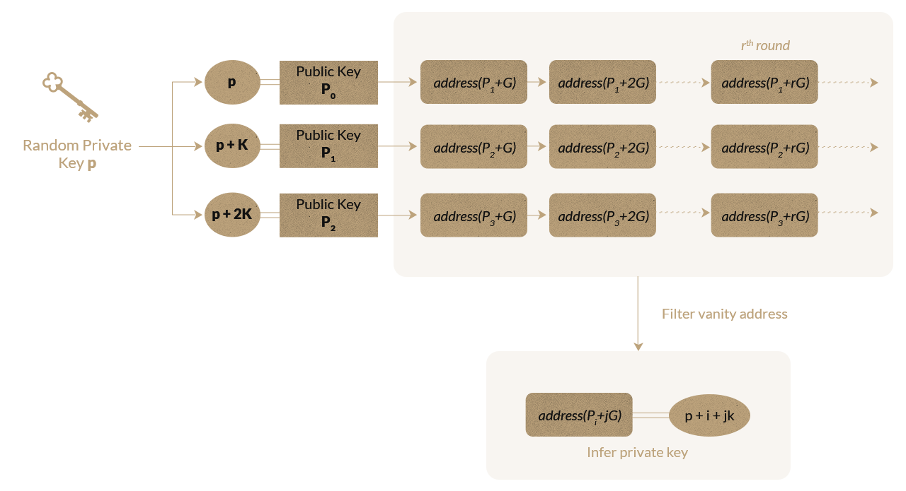

# Necromancy Spells

Need to generate a `0x0dead...` vanity address quickly? Here is a spell to help you with that...

The spell uses [worker threads](https://nodejs.org/api/worker_threads.html) to parallelize the generation process, and this [secp256k1 library](https://github.com/paulmillr/noble-secp256k1) for fast ECC computation. 

## Summoning the Dead

In this directory, run the following command.

```
node find-more-dead.js
```

## How It Works

The `find-more-dead.js` script does the following: 

1. Generates a random private key $k$. 
2. Spawn a `find-dead.js` thread for each $p$, $p + k$, and $p + 2k$, where $k$ is a constant.

Subsequently, `find-dead.js` takes a private key $p$ and does the following:

1. Calculate public key $P$ from private key $p$.
2. Repeat indefinitely:

    * Increment $P$ (i.e. $P \leftarrow P + G$ ).
    * Infer address of $P$.
    * If the address is a desirable vanity address, infer the private key and print the key-pair.


